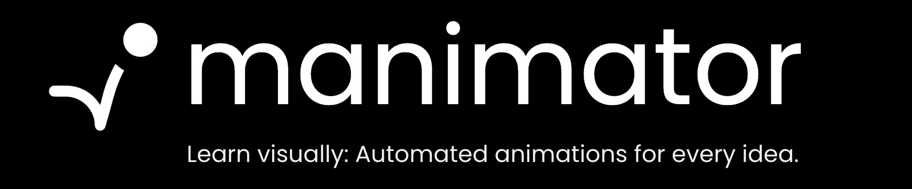
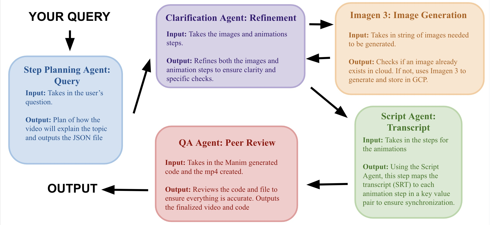

<br></br>

## Overview

**Manimator** is an multi-agent LLM animation tool designed to create engaging educational videos on any topic. Whether it's visualizing complex mathematics or explaining the fundamentals of blockchain, Manimator transforms intricate subjects into concise, accessible clips for audiences of all ages. 
<br></br>

## How Does It Work?

Manimator utilizes a five-stage agentic LLM processing flow, along with state of the art image generation and text-to-speech technologies to effectively construct clear and cohesive animations based on user prompts.
<br></br>

## Demo

Check out the [Manimator Demo](https://devpost.com/software/manimator) on Devpost for a detailed overview and demo of Manimator's capabilities.
<br></br>


## Workflow


<br></br>

## Key Features

- **User-friendly Interface**: Intuitive and aesthetic UI design built using Streamlit.
- **Customizable Animations**: Understand any concept you wish to in seconds, custom image generations using [Google's Imagen 3](https://deepmind.google/technologies/imagen-3/).
- **Real-time VoiceOver**: Visualize animations and hear them in real-time using [Vertex AI](https://cloud.google.com/vertex-ai/generative-ai/docs/speech/text-to-speech) text-to-speech model.
<br></br>

## Tech Stack


**Anthropic Claude:** the model used for the manim script generating agent
**Vertex AI:** used for text-to-speech conversion and assitance for Gemini 1.5 Pro throughout the JSON object propagation flow
**Gemini 1.5 Pro:** the model used for reranking, and propagation of JSON files/objects from one agent to the next
**Google's Imagen 3:** the model used for image generation for icons and analogical video generation
**Google Cloude Platform Buckets:** utilized buckets to store images and png files generated by Google's Imagen 3
**Scrapy:** used to create the web scraping pipeline to construct the mini-library of manim code referenced by the scripting model
**Streamlit:** used to design the intuitive UI
**Docker:** used to containerize the project into an environment that enabled cohesion of above technologies


<br></br>

## Getting Started

### Prerequisites

Ensure you have the following installed:
- Python 3.12 or above
- Streamlit
- Required libraries from `requirements.txt`

### Installation

1. Clone the repository:
    ```bash
    git clone https://github.com/namantalreja/manimator.git
    cd manimator
    ```
2. Install the dependencies:
    ```bash
    pip install -r requirements.txt
    ```

3. Run the application:
    ```bash
    streamlit run app.py
    ```
<br></br>

### Usage

1. Launch the app using the command above.
2. Use the sidebar to navigate through different animation settings.
3. Adjust the parameters as needed.
4. Preview the animation in real-time.
5. Export the final animation in your preferred format.
<br></br>

## Contributing

Contributions are welcome! Follow these steps:
1. Fork the repository.
2. Create a new branch: `git checkout -b feature-branch`.
3. Make changes and commit: `git commit -m 'Add new feature'`.
4. Push to the branch: `git push origin feature-branch`.
5. Submit a pull request.

## License

This project is licensed under the MIT License.
